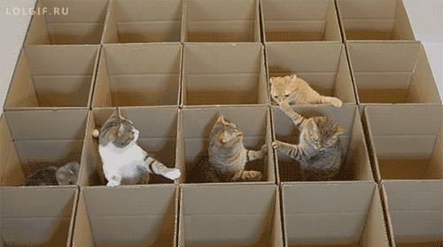

# Cats On The Run 🐈

## Etapa um do projeto

* Encontrar o menor caminho num labirinto de tiles hexagonais
* Um ponto de partida e várias saídas
* Imprimir como resultado uma direção (W, NW, NE, ...) por linha do ponto de partida ao objetivo

			  NW  NE
	    	   \ /
			W - ⬡ - E
			   / \ 
			 SW   SE

## Links de referência

**Representação visual de diversos algoritmos de pathfinding**

[PathFinding.js](https://qiao.github.io/PathFinding.js/visual/)

**Path Finding Algorithms**

[medium.com](https://medium.com/omarelgabrys-blog/path-finding-algorithms-f65a8902eb40)

**Hexagonal Grids**

[redblobgames.com](https://www.redblobgames.com/grids/hexagons/)

**Amit’s Thoughts on Grids**

[www-cs-students.stanford.edu](http://www-cs-students.stanford.edu/~amitp/game-programming/grids/)

**Best-first search**

[courses.cs.washington.edu](https://courses.cs.washington.edu/courses/cse326/03su/homework/hw3/bestfirstsearch.html)

**Algoritmo A**

[growingwiththeweb.com](https://www.growingwiththeweb.com/2012/06/a-pathfinding-algorithm.html)

**Heurísticas**

[theory.stanford.edu/...](http://theory.stanford.edu/~amitp/GameProgramming/Heuristics.html)

**Alguns tipos de disância**

[lyfat.wordpress.com](https://lyfat.wordpress.com/2012/05/22/euclidean-vs-chebyshev-vs-manhattan-distance/)

**Otimizações para pathfinding em grids**

[redblobgames.com](https://www.redblobgames.com/pathfinding/grids/algorithms.html)

## Estrutura básica do projeto

`Root`
│   `__main__.py` - Ponto inicial da execução
│   `Cell.py` - Objeto que representa uma célula do grid. Cada célula armazena quem são seus vizinhos
│   `conf01.py` - Arquivo com entradas para o programa
│   `Directions.py` - Enum com as direções que o gato pode seguir (foi necessário pois é preciso inverter a direção em um ponto)
│   `Executor.py` - Arquivo que irá receber o grid e os gatos para executar a busca
│   `Grid.py` - Arquivo que gerencia um conjunto de células, o grid
│
│
└───`cats` - Diretório onde ficarão os gatos (cada gato deve receber um nó de entrada e um de saída e fazer o caminho usando algum algoritmo ou heurística)
    │   `CatFather.py` - Pai de todos os gatos - ao criar um novo gato herde dele
    │
    ├───`astarcat` 
    │   │   `AstarCat.py` - Gato que faz a busca com o algoritmo A* (V1 - NÃO USAR)
    │   └   `HeuristicValuesCalculator.py` - Arquivo auxiliar para calcular os valores da heurística
    │   
    │
    ├───`astarcat2`
    │   │   `AstarCat.py` - Gato que faz a busca com o algoritmo A* (V2)
    │   └   `HeuristicValuesCalculator.py` - Arquivo auxiliar para calcular os valores da heurística
    │
    ├───`bestfirstcat` 
    │   └   `BestFirstCat.py` - Gato que faz a busca com o algoritmo Best First
    │   
    │
    ├───`bfscat`
    │   └   `BreadthFirstSearchCat.py` - Gato que faz a busca com o algoritmo Breadth First Search (Busca em Largura ou BFS) 
    │
    └───`catshelper` - Diretório com códigos auxiliares para os gatos
        │   `DistanceCalculator.py` - Possibilita o cálculo de distâncias entre pontos no grid (USE A DISTÂNCIA HEXAGONAL PARA ESTE PROBLEMA)
        └   `Path.py` - Possibilita a geração do caminho até o objetivo (não esqueça de definir o valor `previous` para cada nó ao fazer o algoritmo no gato)
        

## Observações

Para obter uma visualização do grid use:

		print(grid.show())

Para visualizar o grid com os movimentos do gato use:

		print(grid.show(cat))

* Caso o caminho seja construído partindo do gato e indo para o objetivo use `reversed_direction = True` ao atribuir o objeto `Path` ao gato. caso o caminho seja construído do fim para o começo use `reversed_direction = False`: construindo do começo para o fim cada ponto do labirinto apontará para um ponto anterior (mais perto do início) então o caminho formado será do fim para o incício... marcando `reversed_direction = True` o caminho resultante será invertido:

Sem inverter:

INICIO <- ( ) <- ( ) <- ( ) <- ( ) <- FIM

gera:

W, W, W, W, W,

Invertendo para o correto:

INICIO -> ( ) -> ( ) -> ( ) -> ( ) -> FIM

E, E, E, E, E,